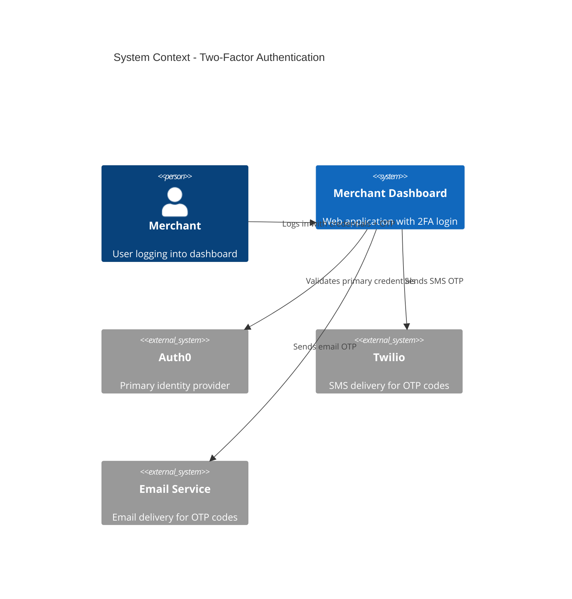
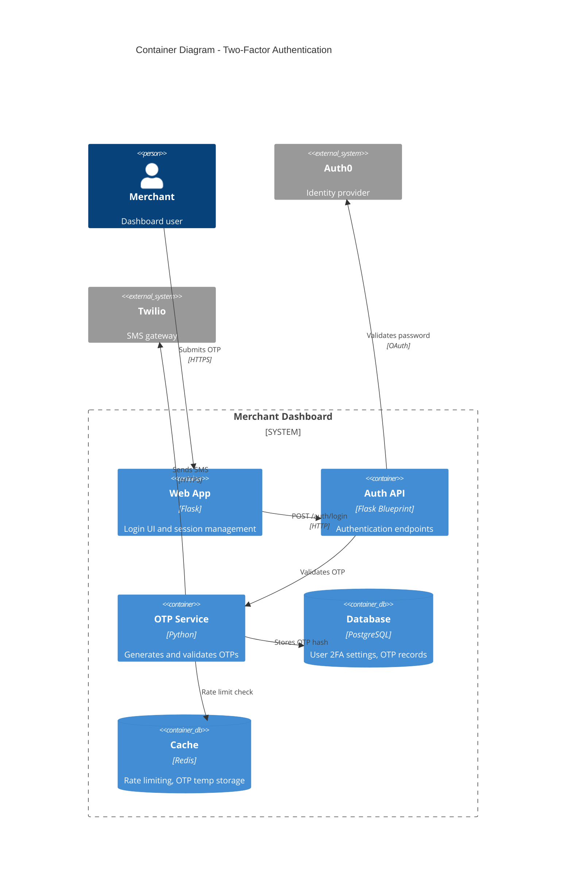

# 2FA Login Process Architecture

## Context Diagram (L1)

Merchants authenticate via the dashboard, which validates primary credentials through Auth0 and delivers one-time passwords via SMS or email.

## Container Diagram (L2)

Login flow: web app calls auth API, which validates credentials via Auth0, then triggers OTP generation and delivery. OTP validation completes the 2FA flow.
