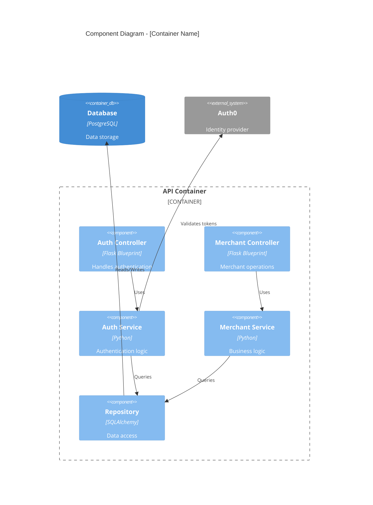

# Component Diagram (L3) - Mermaid Template

**Only generate when explicitly requested.** Shows internal components within a container.

## Elements

| Element | Usage |
|---------|-------|
| `Container_Boundary(id, "Name")` | The container being detailed |
| `Component(id, "Name", "Tech", "Desc")` | Internal component |
| `Rel(from, to, "Label")` | Dependency/call |
