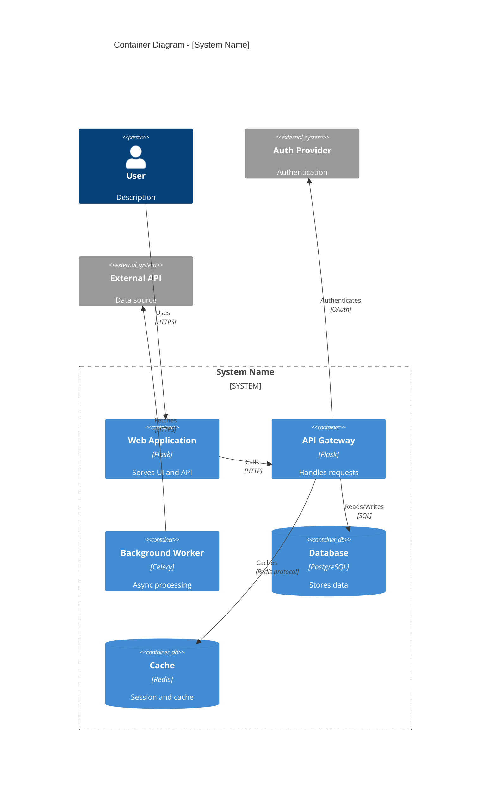

# Container Diagram (L2) - Mermaid Template

Shows the high-level technical building blocks (containers) within the system.

## Elements

| Element | Usage |
|---------|-------|
| `System_Boundary(id, "Name")` | Groups containers |
| `Container(id, "Name", "Tech", "Desc")` | Application/service |
| `ContainerDb(id, "Name", "Tech", "Desc")` | Database |
| `ContainerQueue(id, "Name", "Tech", "Desc")` | Message queue |
| `Rel(from, to, "Label", "Tech")` | Relationship |
