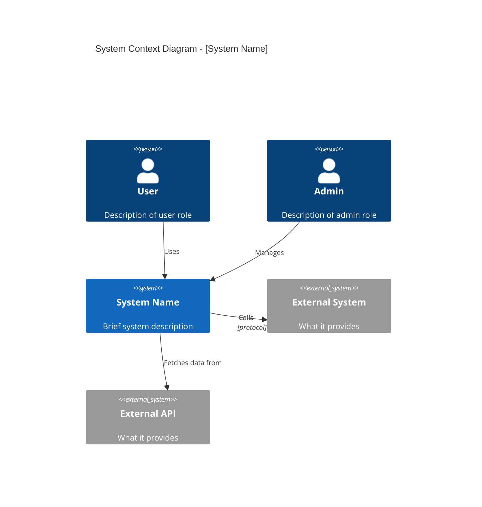

# Context Diagram (L1) - Mermaid Template

Shows the system in scope and its relationships with external actors and systems.

## Elements

| Element | Usage |
|---------|-------|
| `Person(id, "Name", "Desc")` | Human actors |
| `System(id, "Name", "Desc")` | System in scope |
| `System_Ext(id, "Name", "Desc")` | External systems |
| `Rel(from, to, "Label")` | Relationships |
| `Rel(from, to, "Label", "Tech")` | Relationship with technology |
